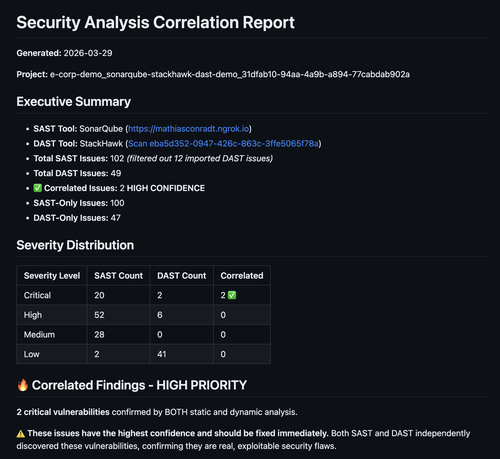
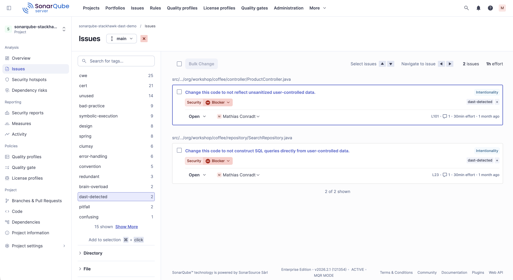
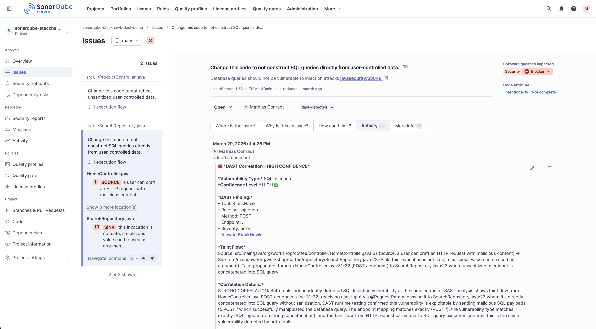

# SonarQube + StackHawk Correlation Example

This example demonstrates a real-world correlation analysis between SonarQube SAST findings and StackHawk DAST scan results.

## Overview

This correlation was performed on a Java Spring Boot application with intentional security vulnerabilities for testing purposes.

### Test Application Details

- **Language**: Java
- **Framework**: Spring Boot
- **SAST Tool**: SonarQube (with SonarJava security rules)
- **DAST Tool**: StackHawk
- **Scan Date**: March 29, 2026

## Key Findings

### 2 HIGH CONFIDENCE Correlations

Both SAST and DAST independently detected these vulnerabilities, confirming they are **exploitable in runtime**:

1. **SQL Injection** - `SearchRepository.java:23`
   - **SAST Rule**: `javasecurity:S3649`
   - **DAST Finding**: `sql-injection` at `POST /`
   - **Confidence**: HIGH ✅
   - **Reason**: Exact endpoint match + complete taint flow from HTTP request to SQL query

2. **Cross-Site Scripting (XSS)** - `ProductController.java:101`
   - **SAST Rule**: `javasecurity:S5131`
   - **DAST Finding**: `cross-site-scripting-reflected` at `GET /products/direct`
   - **Confidence**: HIGH ✅
   - **Reason**: Exact endpoint match + complete taint flow from HTTP parameter to HTML output

## Files in This Example

### `sast-dast-correlation-report.md`

Complete correlation report including:
- Executive summary with metrics
- Detailed taint flow analysis for each correlation
- SAST-only findings (100 code-level issues)
- DAST-only findings (47 runtime/configuration issues)
- Coverage analysis
- Prioritized remediation recommendations

### `correlations.json`

Machine-readable correlation data with:
- SAST issue details (rule, component, line, severity, taint flow)
- DAST finding details (rule ID, URI, method, severity)
- Detailed correlation reasoning
- Confidence levels
- Summary statistics

## Correlation Statistics

| Metric | Count |
|--------|-------|
| Total SAST Issues | 102 |
| SAST Issues (after filtering) | 102 |
| External Issues Filtered | 12 |
| Total DAST Issues | 49 |
| High Confidence Correlations | 2 |
| SAST-Only Issues | 100 |
| DAST-Only Issues | 47 |

### Severity Breakdown

| Severity | SAST | DAST | Correlated |
|----------|------|------|------------|
| Critical | 20 | 2 | 2 ✅ |
| High | 52 | 6 | 0 |
| Medium | 28 | 0 | 0 |
| Low | 2 | 41 | 0 |

## Correlation Insights

### Why Only 2 Correlations?

The 2% correlation rate (2 out of 102 SAST issues) is **typical and expected**:

- **SAST detects potential vulnerabilities** - These are code patterns that *could* be exploited
- **DAST confirms actual exploitability** - These are vulnerabilities that *are* exploitable at runtime
- **Correlated = Highest Priority** - When both tools agree, it's a confirmed security risk

### SAST-Only Findings (100 issues)

These code-level issues were not exploitable at runtime:
- Path traversal vulnerabilities (not reachable endpoints)
- XXE issues (XML parsing not exposed)
- Command injection (sanitization present at runtime)
- Code quality and anti-pattern issues

### DAST-Only Findings (47 issues)

These runtime issues are not detectable by static analysis:
- Missing security headers (X-Frame-Options, CSP, etc.)
- CSRF protection gaps
- Session management issues
- TLS/SSL configuration
- Cookie security settings

## Taint Flow Examples

### SQL Injection Taint Flow

```
SOURCE: HomeController.java:31 (HTTP POST request)
  ↓ @RequestParam captures user input
PROPAGATION: HomeController.java:31-32
  ↓ Passes to SearchRepository.search()
SINK: SearchRepository.java:23 (SQL concatenation)
  ↓ Unsanitized input directly concatenated into SQL query
EXPLOIT: DAST confirmed at POST /
```

### XSS Taint Flow

```
SOURCE: ProductController.java:71 (HTTP GET request)
  ↓ @RequestParam 'param' captures user input
PROPAGATION: ProductController.java:71→78→82→101
  ↓ Passes through method chain
SINK: ProductController.java:101 (HTML output)
  ↓ Unsanitized input directly output to HTML response
EXPLOIT: DAST confirmed at GET /products/direct?param=<script>alert(1)</script>
```

## How This Example Was Generated

1. **SonarQube Scan**:
   ```bash
   sonar-scanner \
     -Dsonar.projectKey=e-corp-demo \
     -Dsonar.sources=src \
     -Dsonar.host.url=https://mathiasconradt.ngrok.io \
     -Dsonar.login=$SONAR_TOKEN
   ```

2. **StackHawk Scan**:
   ```bash
   hawkscan
   ```

3. **Correlation Analysis**:
   ```bash
   # In Claude Code
   /sonarqube-sast-dast-correlation
   # Selected: stackhawk.fixed.sarif
   ```

## Key Takeaways

1. **Prioritization Works**: Focus on the 2 correlated HIGH CONFIDENCE vulnerabilities first
2. **Both Tools Are Necessary**: SAST and DAST find different vulnerability types
3. **Taint Flow Analysis**: Understanding data flow from source to sink helps validate correlations
4. **Confidence Scoring**: HIGH confidence = same vuln type + exact endpoint + taint flow match

## Using This Example

This example can help you:
- Understand what a correlation report looks like
- See how taint flow analysis works
- Learn how to interpret confidence levels
- Understand why correlation rates are typically low (2-5%)
- Get ideas for reporting to your security team

## Screenshots

### Correlation Report (HTML Rendering)

The generated markdown report rendered in a browser, showing the executive summary, correlated findings, and detailed taint flow analysis:



### SonarQube Tagged Issues

Correlated issues tagged with `dast-detected` in SonarQube, making it easy for development teams to prioritize fixes:



### Complete Example View

Full correlation analysis showing SonarQube SAST findings mapped to StackHawk DAST results:



---

**Note**: This example uses a test application with intentional vulnerabilities. Always fix security issues in production code immediately.
